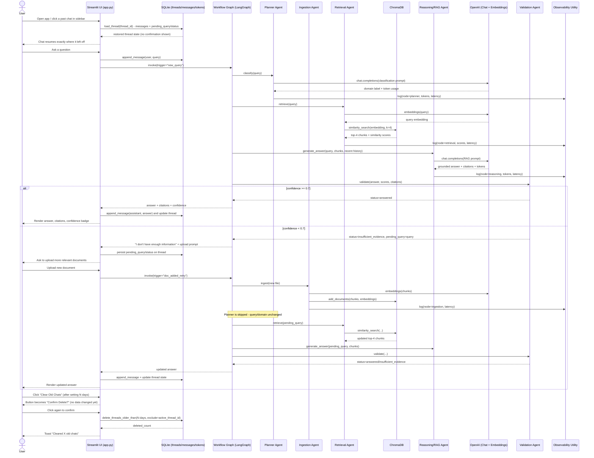
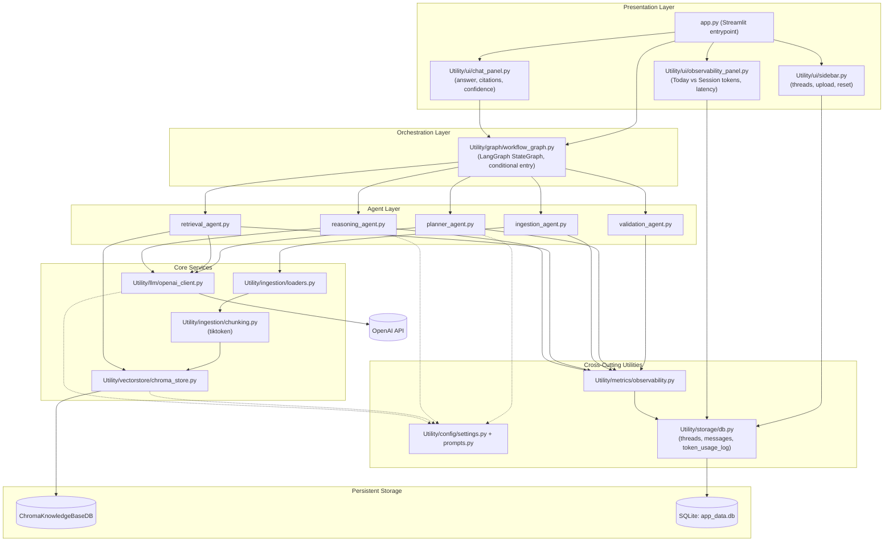
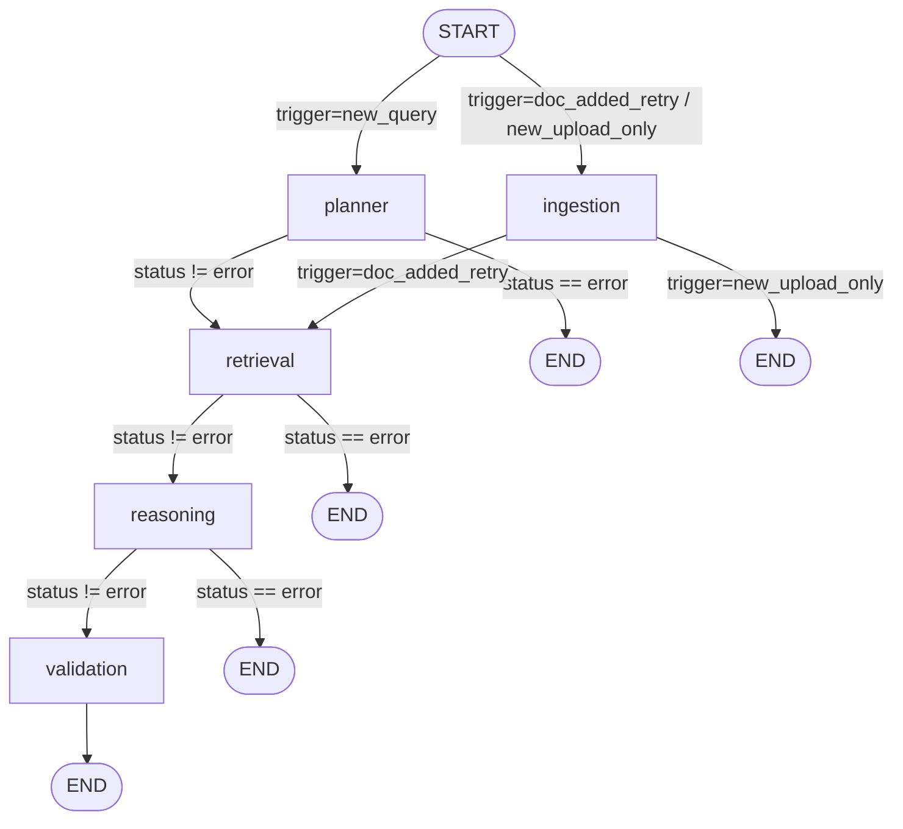
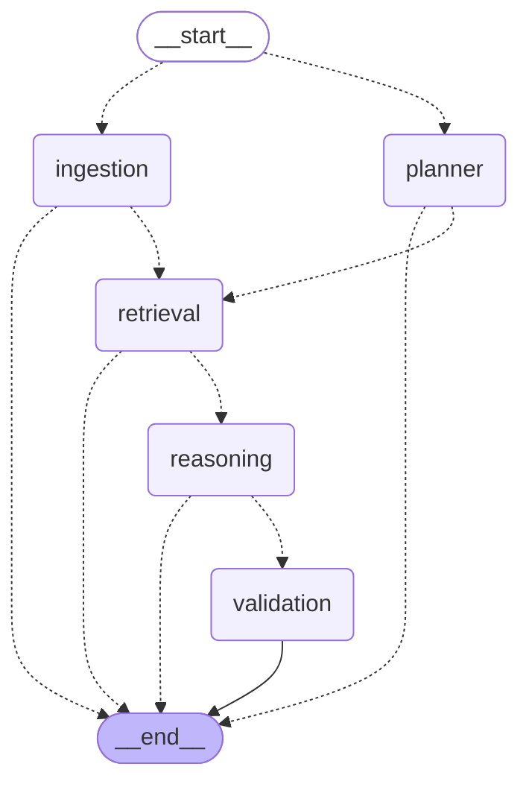

# Multi-Agent Enterprise Knowledge Assistant — Capstone Project Plan

> Generative AI + Agentic RAG assistant over enterprise/3GPP telecom documents.
> Status: Plan approved through iterative review (2026-09-07). Ready for implementation.

## 1. Project Description
Streamlit application where users upload enterprise documents (PDF, TXT, CSV, Excel, Word) and ask
natural language questions. A team of LangGraph agents plans the query, retrieves relevant content
from a ChromaDB vector store, reasons over it with an LLM, and validates the answer before showing
it — falling back to "I don't have enough information" instead of fabricating an answer when
evidence is weak.

## 2. Official Spec Compliance
| Requirement | How it's met |
|---|---|
| Multi-format upload (PDF/TXT/CSV/Excel) | `Utility/ingestion/loaders.py` (Word added as extra) |
| NL Q&A | Streamlit chat panel |
| Vector DB semantic search | ChromaDB (`ChromaKnowledgeBaseDB`) |
| RAG pipeline | Reasoning/RAG agent |
| Agentic reasoning (plan/retrieve/reason/validate) | 5-agent LangGraph workflow |
| Guardrails / reliability | Validation agent, input/file checks, no-fabrication fallback |
| Simple/intuitive UI | Streamlit sidebar + chat + observability panel |
| Deploy + document | Docker + this document |

## 3. Tech Stack & Key Decisions
- **App**: Python, Streamlit (no separate FastAPI backend — Streamlit calls the agent pipeline directly)
- **Vector store**: ChromaDB, persisted at `ChromaKnowledgeBaseDB/`
- **LLM**: OpenAI `gpt-4o-mini` (Planner + Reasoning agents)
- **Embeddings**: OpenAI `text-embedding-3-small`
- **Chunking**: token-based (tiktoken), ~800 tokens / ~100 overlap (range 500-1000)
- **Retrieval**: top-k = 8 chunks per query
- **Confidence threshold**: 0.7 (below this → "insufficient evidence")
- **Upload guardrails**: 20MB max file size, allowed extensions: pdf, txt, csv, xlsx/xls, docx/doc
- **Persistence**: SQLite (`Utility/storage/app_data.db`) for chat threads, messages, token usage logs
- **Observability**: custom instrumentation only (no LangSmith)
- **Orchestration**: LangGraph `StateGraph` with conditional entry point
- **Data**: public only — 3GPP docs and telecom AI resources; sample files are uploaded manually by the user and never indexed automatically

### Session isolation
- Each Streamlit browser session receives a random `session_id`.
- Uploaded files are stored under `Input Data/<session_id>/`.
- Chroma uses a session-specific collection, and SQLite uses `Utility/storage/sessions/<session_id>.db`.
- Chat history, token metrics, and retrieval results cannot cross session boundaries.

### Explicitly deferred to Future Enhancements (not built in MVP)
- Web-scraping ingestion agent (auto-expanding corpus from 3GPP/related sites)
- Dedicated Citation agent (folded into Reasoning agent's output formatting instead)
- Dedicated Observability agent (implemented as a cross-cutting utility instead)
- LangSmith tracing integration

## 4. Agent Design (5 agents, reconciled from 3 conflicting drafts)
1. **Planner/Orchestrator** (LLM) — classifies query domain (3G/5G/6G/AI-Telecom/other), sets routing state
2. **Ingestion pipeline** (tool node, no LLM reasoning) — parses, chunks, embeds, stores documents
3. **Retrieval Agent** (no LLM) — embeds query, similarity search in Chroma, returns top-k chunks + scores
4. **Reasoning/RAG Agent** (LLM) — generates grounded answer + citations, includes recent thread history for follow-up coherence
5. **Validation Agent** (rule-based, LLM optional) — computes confidence from the strongest semantic similarity or meaningful-term overlap, requires citation presence, and rejects explicit model refusals even when retrieval confidence is high; below threshold → asks user to upload more documents (no auto web-scraping)

### Workflow triggers (conditional entry into the graph)
- `new_query` — full run: Planner → Retrieval → Reasoning → Validation
- `doc_added_retry` — Ingestion → Retrieval → Reasoning → Validation, reusing `pending_query`, **skipping Planner** (domain unchanged)
- `new_upload_only` — proactive upload with no pending query: Ingestion only

## 5. Chat History & Observability (added via user follow-up requests)
- **Persistence**: SQLite tables `chat_threads` (incl. `pending_query`, `status` for accurate resume),
  `chat_messages`, `token_usage_log`
- **Resume behavior**: clicking a past chat in the sidebar continues that same thread immediately —
  no confirmation dialogs, restores `pending_query`/`status` so an in-progress "awaiting more
  documents" state resumes correctly
- **Observability panel**: two token stat cards —
  - **Today** = tokens used today, scoped to the currently open thread
  - **This Session** = lifetime token total for the currently open thread
  - plus latency, similarity scores, and per-agent execution timing
- **Retention/reset control**: sidebar has an adjustable "clear chats older than N days" input +
  a two-step inline confirm button ("Clear Old Chats" → "Confirm Delete?" → deletes); the
  currently active thread is always excluded regardless of age

## 6. Project Structure
```
PG ML Final Project/
├── .env / .env.example / .gitignore / requirements.txt / Dockerfile
├── app.py                          # Streamlit entrypoint
├── Sample Data/                    # preloaded demo docs (renamed from original "Input Data")
├── Input Data/                     # runtime user-uploaded docs
├── ChromaKnowledgeBaseDB/          # Chroma persistence dir
├── UI Images/                      # branding assets
└── Utility/
    ├── agents/                     # planner_, ingestion_, retrieval_, reasoning_, validation_agent.py
    ├── graph/workflow_graph.py     # LangGraph StateGraph + conditional entry
    ├── ingestion/                  # loaders.py, chunking.py
    ├── vectorstore/chroma_store.py
    ├── llm/openai_client.py
    ├── storage/db.py               # SQLite CRUD (threads/messages/token logs)
    ├── metrics/observability.py    # token/latency/similarity/timing instrumentation
    ├── config/                     # settings.py, prompts.py
    └── ui/                         # sidebar.py, chat_panel.py, observability_panel.py
```

## 7. Sequence Diagram


## 8. Module Interaction Diagram


## 9. Compiled Workflow Graph (as implemented in `Utility/graph/workflow_graph.py`)
Labeled version showing the actual routing conditions:


Raw diagram generated directly from the compiled graph object (`graph.get_graph().draw_mermaid()`),
kept here to catch any future drift between the docs and the actual code:


## 10. Implementation Phases
0. **Repo reconciliation** — rename `Input Data`→`Sample Data`, create new `Input Data` for uploads,
   `Utils`→`Utility`, `ChromaKnowledgeBase`→`ChromaKnowledgeBaseDB`; add `.env`/`.env.example`/
   `.gitignore`/`requirements.txt`
1. **Config & LLM wrappers** — `Utility/config/`, `Utility/llm/openai_client.py`
2. **Ingestion pipeline** — `Utility/ingestion/loaders.py` + `chunking.py`, `Utility/vectorstore/chroma_store.py`
3. **Agents** — `Utility/agents/*` (planner, ingestion, retrieval, reasoning, validation)
4. **LangGraph wiring** — `Utility/graph/workflow_graph.py`, `GraphState`, conditional entry edges
5. **Persistence layer** — `Utility/storage/db.py` (SQLite schema + CRUD incl. retention delete)
6. **Observability utility** — `Utility/metrics/observability.py` (writes to `token_usage_log`)
7. **Streamlit UI** — `app.py`, `Utility/ui/{sidebar,chat_panel,observability_panel}.py`
8. **Guardrails polish** — input/file validation, error handling, no-fabrication wording, basic
   prompt-injection mitigation
9. **Deployment & docs** — Dockerfile, architecture doc, setup steps, limitations, future enhancements
10. **Verification** — see Test Plan below

## 11. Test Plan
| # | Test | Expected Result |
|---|---|---|
| 1 | Ingest each sample format (CSV, TXT, PDF, Word, Excel) individually | Correct chunk counts, chunks stored in Chroma with metadata |
| 2 | Ask a well-covered 3GPP question | Grounded answer, citations shown, confidence ≥ 0.7 |
| 3 | Ask an out-of-scope question | "Insufficient information" message + upload prompt shown |
| 4 | Upload a relevant doc after insufficient-evidence response | Graph resumes at Ingestion→Retrieval→Reasoning→Validation using same pending query, Planner skipped |
| 5 | Submit a new/different query after an insufficient-evidence state | Full pipeline reruns from Planner |
| 6 | Observability panel after a turn | Non-zero token/latency/similarity/timing values displayed |
| 7 | Docker build + run | App reachable; Chroma data persists across container restart via volume |
| 8 | Close/reopen app, reopen a thread with pending insufficient-evidence state, upload doc | Resumes at Ingestion using persisted `pending_query`, not a fresh Planner run |
| 9 | Ask questions in the same thread across two different days | "Today" token card shows only today's usage; "This Session" shows full thread lifetime total |
| 10 | Backdate several threads past retention threshold, mark one as active, run reset | Only non-active, over-threshold threads deleted; active thread survives |
| 11 | Click "Clear Old Chats" once, then Cancel | No deletion occurs |
| 12 | Click "Clear Old Chats" twice (confirm) | Deletion occurs, toast shows correct deleted count |
| 13 | Click any thread in sidebar list | Resumes instantly, zero dialogs/confirmations |

## 12. Known Prerequisites / Open Items
- `Sample Data` currently only has 2 files (CSV + TXT); the additional files referenced in the
  original proposal (.doc, .xlsx, PDF) need to be supplied by the user before a full-format demo
- OpenAI API key must be provided via `.env` (`OPENAI_API_KEY`)

## 13. Future Enhancements (documented, not built)
- Web-scraping ingestion agent to auto-expand the 3GPP corpus from public sources
- Dedicated Citation agent for more advanced reference formatting
- Dedicated Observability agent / LangSmith tracing integration
- Multi-user auth and per-user chat history separation
